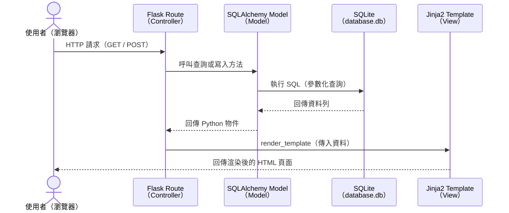

# 食譜收藏夾系統 — 系統架構文件

> 根據 `docs/PRD.md` 設計，適用於 Python Flask + Jinja2 + SQLite 的單人食譜管理系統。

---

## 1. 技術架構說明

### 1.1 選用技術與原因

| 技術 | 版本建議 | 選用原因 |
| :--- | :--- | :--- |
| **Python** | 3.10+ | 主開發語言，語法直覺、生態豐富 |
| **Flask** | 3.x | 輕量 Web 框架，適合個人專案，設定簡單快速上手 |
| **Jinja2** | （Flask 內建） | 與 Flask 深度整合的模板引擎，預設自動 HTML 逸出（防 XSS） |
| **SQLAlchemy** | 2.x | ORM 工具，以物件操作資料庫，自動使用參數化查詢（防 SQL Injection） |
| **SQLite** | （Python 內建） | 零設定的輕量資料庫，單人使用效能足夠，資料存於單一 `.db` 檔案 |
| **HTML / CSS** | — | 前端結構與樣式，由 Jinja2 模板渲染，不需前後端分離 |

---

### 1.2 Flask MVC 模式說明

本專案採用 **MVC（Model-View-Controller）** 架構，三層各司其職：

| 層級 | 對應位置 | 職責說明 |
| :--- | :--- | :--- |
| **Model（模型）** | `app/models/` | 定義資料表結構，負責對 SQLite 進行查詢、新增、修改、刪除等操作 |
| **View（視圖）** | `app/templates/` | Jinja2 HTML 模板，負責決定畫面如何呈現資料給使用者 |
| **Controller（控制器）** | `app/routes/` | Flask 路由，接收 HTTP 請求，呼叫 Model 取得資料，再交給 View 渲染回傳 |

---

## 2. 專案資料夾結構

```
food-recipe-app/              ← 專案根目錄
│
├── app/                      ← 主應用程式套件
│   │
│   ├── __init__.py           ← 建立 Flask app 實例、初始化資料庫
│   │
│   ├── models/               ← 【Model 層】資料庫模型定義
│   │   ├── __init__.py
│   │   ├── recipe.py         ← Recipe（食譜）資料表模型
│   │   ├── ingredient.py     ← Ingredient（食材）資料表模型
│   │   └── category.py       ← Category（分類）資料表模型
│   │
│   ├── routes/               ← 【Controller 層】Flask 路由（Blueprint）
│   │   ├── __init__.py
│   │   ├── recipe_routes.py  ← 食譜的 CRUD 路由（新增、列表、詳情、編輯、刪除）
│   │   └── search_routes.py  ← 搜尋與食材推薦路由
│   │
│   ├── templates/            ← 【View 層】Jinja2 HTML 模板
│   │   ├── base.html         ← 共用版型（導覽列、頁首、頁尾）
│   │   ├── index.html        ← 食譜列表首頁
│   │   ├── recipe/
│   │   │   ├── detail.html   ← 食譜詳細內容頁
│   │   │   ├── create.html   ← 新增食譜表單頁
│   │   │   └── edit.html     ← 編輯食譜表單頁
│   │   └── search/
│   │       └── results.html  ← 搜尋結果頁
│   │
│   └── static/               ← 靜態資源（不會被 Flask 處理，直接提供給瀏覽器）
│       ├── css/
│       │   └── style.css     ← 全站樣式表
│       └── js/
│           └── main.js       ← 前端互動腳本（如：食材動態新增欄位）
│
├── instance/                 ← 【執行期設定】不納入版本控制
│   └── database.db           ← SQLite 資料庫檔案
│
├── docs/                     ← 專案文件
│   ├── PRD.md                ← 產品需求文件
│   ├── ARCHITECTURE.md       ← 本系統架構文件（此檔案）
│   └── ...                   ← 後續的流程圖、API 設計文件等
│
├── app.py                    ← 應用程式入口，啟動 Flask dev server
├── requirements.txt          ← Python 套件清單（flask、sqlalchemy 等）
└── .gitignore                ← 排除 instance/、__pycache__/、venv/ 等
```

---

## 3. 元件關係圖

### 3.1 請求 / 回應流程（Mermaid）



### 3.2 模組依賴關係（ASCII）

```
    ┌─────────────────────────────────────────┐
    │               app.py（入口）             │
    └──────────────────┬──────────────────────┘
                       │ 建立 Flask App
                       ▼
    ┌─────────────────────────────────────────┐
    │           app/__init__.py               │
    │  • 初始化 Flask                          │
    │  • 初始化 SQLAlchemy                     │
    │  • 註冊 Blueprint（routes）              │
    └──────┬──────────────────────┬───────────┘
           │                      │
           ▼                      ▼
    ┌─────────────┐      ┌──────────────────┐
    │  app/routes │      │   app/models/    │
    │  （Blueprint）│◄────►│  Recipe          │
    │  recipe     │      │  Ingredient      │
    │  search     │      │  Category        │
    └──────┬──────┘      └────────┬─────────┘
           │                      │
           ▼                      ▼
    ┌─────────────┐      ┌──────────────────┐
    │ app/templates│     │ instance/        │
    │ （Jinja2）  │      │ database.db      │
    │ base.html   │      │ （SQLite 檔案）   │
    │ index.html  │      └──────────────────┘
    │ recipe/...  │
    └─────────────┘
```

---

## 4. 關鍵設計決策

### 決策 1：使用 Flask Blueprint 拆分路由

**做法：** 將食譜 CRUD 路由（`recipe_routes.py`）與搜尋路由（`search_routes.py`）分為不同的 Blueprint。  
**原因：** 避免所有路由擠在單一檔案造成難以維護，Blueprint 讓每個功能模組可以獨立開發與測試，未來新增功能時也更容易擴充。

---

### 決策 2：使用 SQLAlchemy ORM 而非裸 SQL

**做法：** 透過 SQLAlchemy 定義 Model 類別，所有資料庫操作以 Python 物件方式進行。  
**原因：** ORM 自動使用參數化查詢，從根本防止 SQL Injection；同時讓程式碼更容易閱讀，降低新手撰寫危險 SQL 的機率。

---

### 決策 3：以 `base.html` 作為所有頁面的共用版型

**做法：** 所有頁面模板繼承 `base.html`，使用 Jinja2 的 `` 語法插入各頁面的內容。  
**原因：** 導覽列、頁首頁尾、CSS 引入等共用元素只需維護一份，修改版型時整站同步更新，符合 DRY（Don't Repeat Yourself）原則。

---

### 決策 4：`instance/` 資料夾存放 SQLite，並排除於版本控制

**做法：** Flask 預設的 `instance/` 資料夾用於存放 `database.db`，在 `.gitignore` 中排除此目錄。  
**原因：** 資料庫內容屬於執行期資料（非原始碼），不應納入 Git。每位開發者（或部署環境）應擁有獨立的資料庫實例，避免資料污染或衝突。

---

### 決策 5：食材設計為獨立資料表，以多對多關聯連結食譜

**做法：** `Ingredient` 為獨立資料表，透過關聯表（`recipe_ingredient`）與 `Recipe` 建立多對多關係，並儲存份量資訊。  
**原因：** 「根據手邊食材推薦食譜」功能需要跨食譜查詢特定食材，如果食材只是食譜的純文字欄位，將無法進行有效的交集查詢。獨立資料表讓搜尋可以精準比對。

---

*文件版本：v1.0 | 建立日期：2026-04-21 | 對應 PRD 版本：v1.0*
