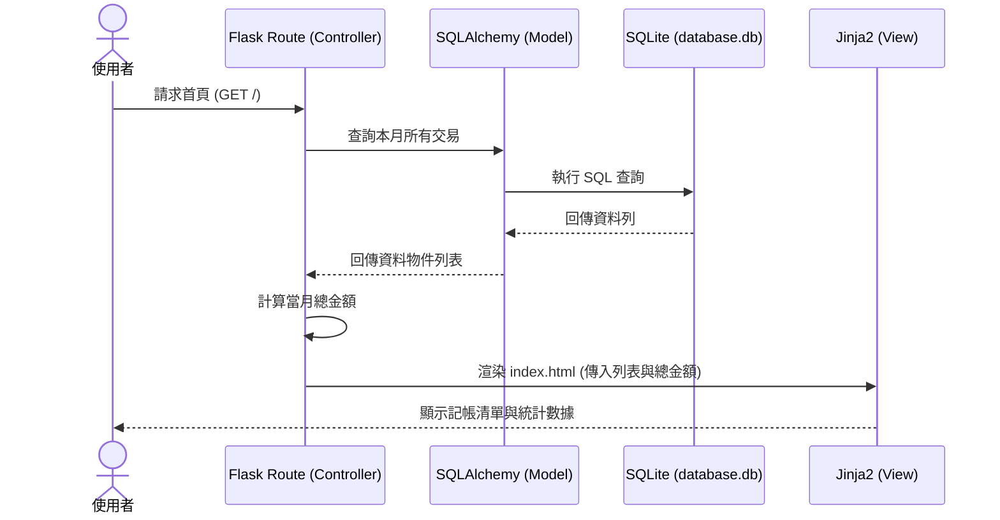

# 快速小資記帳 — 系統架構文件

> 本文件根據 `docs/PRD.md` 規劃，定義了本記帳系統的技術實作框架與專案組織。

---

## 1. 技術架構說明

### 1.1 選用技術與原因

| 技術 | 用途 | 選用原因 |
| :--- | :--- | :--- |
| **Python** | 開發語言 | 語法簡潔，適合開發 Web 後端邏輯。 |
| **Flask** | Web 框架 | 輕量且靈活，適合小型專案快速開發。 |
| **Jinja2** | 模板引擎 | Flask 內建，方便在 HTML 中嵌入動態數據（如總支出統計）。 |
| **SQLite** | 資料庫 | 零設定、單一檔案，極適合個人記帳用途。 |
| **SQLAlchemy** | ORM 工具 | 以物件導向方式操作資料庫，提升程式碼可讀性與安全性。 |

### 1.2 Flask MVC 模式說明

本專案遵循 **MVC（Model-View-Controller）** 架構設計：

- **Model（模型）**: 位於 `app/models/`，負責定義「消費紀錄」的資料結構（金額、類別、備忘、時間）以及與 SQLite 的溝通。
- **View（視圖）**: 位於 `app/templates/`，使用 Jinja2 撰寫 HTML 模板，負責將資料視覺化呈現給使用者。
- **Controller（控制器）**: 位於 `app/routes/`，負責處理使用者的請求（如：點擊「刪除」按鈕），執行對應邏輯後決定回傳哪個頁面。

---

## 2. 專案資料夾結構

```text
quick-spend-app/           ← 專案根目錄
│
├── app/                   ← 應用程式核心資料夾
│   ├── __init__.py        ← 初始化 Flask 與資料庫元件
│   ├── models/            ← 【Model】
│   │   └── transaction.py ← 消費紀錄資料模型
│   ├── routes/            ← 【Controller】
│   │   └── main_routes.py ← 處理新增、刪除與首頁顯示之路由
│   ├── templates/         ← 【View】
│   │   ├── base.html      ← 共用版型
│   │   └── index.html     ← 首頁（含支出列表與當月統計）
│   └── static/            ← 靜態資源
│       └── css/
│           └── style.css  ← 網站視覺樣式
│
├── instance/              ← 執行期產生之檔案
│   └── database.db        ← SQLite 資料庫檔案
│
├── docs/                  ← 專案文件
│   ├── PRD.md             ← 產品需求文件
│   └── ARCHITECTURE.md    ← 本架構文件
│
├── app.py                 ← 程式進入點（啟動伺服器）
├── requirements.txt       ← 套件清單（flask, flask-sqlalchemy）
└── .gitignore             ← 排除不需進入 Git 的檔案（如 .db, __pycache__）
```

---

## 3. 元件關係與流程

### 3.1 請求處理流程圖



---

## 4. 關鍵設計決策

### 決策 1：後端即時統計總支出
**做法**：當使用者請求首頁時，由 Controller 呼叫 Model 取得當月紀錄後，即時加總並傳給 View。  
**原因**：保持資料的唯一真實來源，避免前端 JavaScript 計算出錯或與資料庫不同步。

### 決策 2：單一資料表設計
**做法**：初期僅建立 `Transaction` 一張表，存放所有必要欄位（金額、類別、備註、時間）。  
**原因**：針對精簡版需求，單一資料表查詢效能最佳，結構最簡單，方便後續擴張。

### 決策 3：使用 SQLAlchemy ORM
**做法**：不直接寫 SQL 字串，而是透過 Python 物件進行操作。  
**原因**：防止 SQL Injection 攻擊，提升程式開發速度與後續維護彈性。

### 決策 4：Jinja2 伺服器端渲染
**做法**：不使用複雜的 React/Vue 前端框架，直接由 Flask 渲染 HTML。  
**原因**：記帳功能相對單純，傳統渲染方式能大幅降低系統複雜度，並提供更快的首屏載入速度。

---
*文件版本：v1.0 | 建立日期：2026-04-23*
