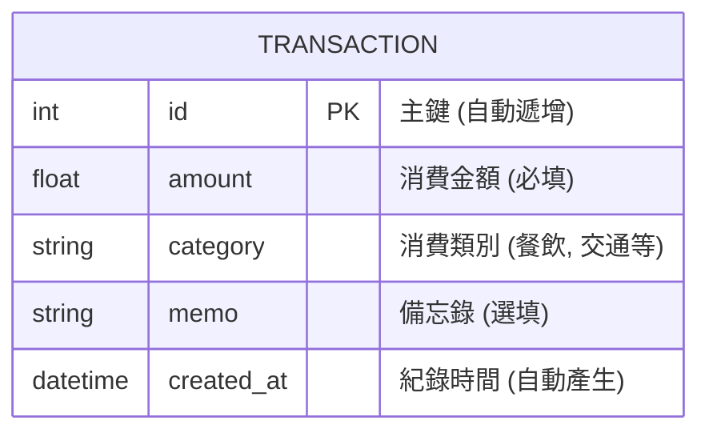

# 快速小資記帳 (QuickSpend) — 資料庫設計

> 本文件定義了系統的資料模型、表結構以及實作邏輯，確保資料存儲的一致性與安全性。

---

## 1. ER 圖 (Entity-Relationship Diagram)

系統採單一資料表設計，專注於消費紀錄的存儲。



---

## 2. 資料表詳細說明

### 2.1 `transaction` (消費紀錄表)

| 欄位名稱 | 型別 | 屬性 | 說明 |
| :--- | :--- | :--- | :--- |
| `id` | INTEGER | PRIMARY KEY, AUTOINCREMENT | 唯一識別碼 |
| `amount` | FLOAT | NOT NULL | 消費金額，不允許空值 |
| `category` | TEXT | NOT NULL | 消費分類（如：餐飲、交通、購物） |
| `memo` | TEXT | NULL | 額外的註解或備忘內容 |
| `created_at` | DATETIME | NOT NULL, DEFAULT CURRENT_TIMESTAMP | 紀錄建立的日期與時間 |

---

## 3. SQL 建表語法

儲存於 `database/schema.sql`，用於手動初始化資料庫或備份參考。

```sql
-- 建立消費紀錄表
CREATE TABLE IF NOT EXISTS transactions (
    id INTEGER PRIMARY KEY AUTOINCREMENT,
    amount REAL NOT NULL,
    category TEXT NOT NULL,
    memo TEXT,
    created_at DATETIME DEFAULT CURRENT_TIMESTAMP
);
```

---

## 4. Python Model 實作

採用 **Flask-SQLAlchemy** 進行開發。每個 Model 包含基本的 CRUD 方法。

- **檔案路徑**：`app/models/transaction.py`

### 關鍵功能說明
- **資料驗證**：在 `amount` 欄位設定 `nullable=False` 確保資料完整性。
- **預設值**：`created_at` 使用 `datetime.utcnow` 作為預設值。
- **封裝方法**：Model 內部封裝了 `to_dict()` 方法，方便未來 API 擴充。

---
*文件版本：v1.0 | 建立日期：2026-04-23*
