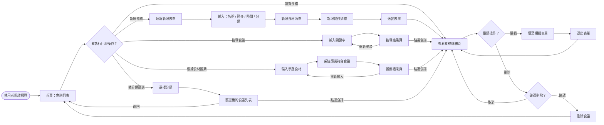
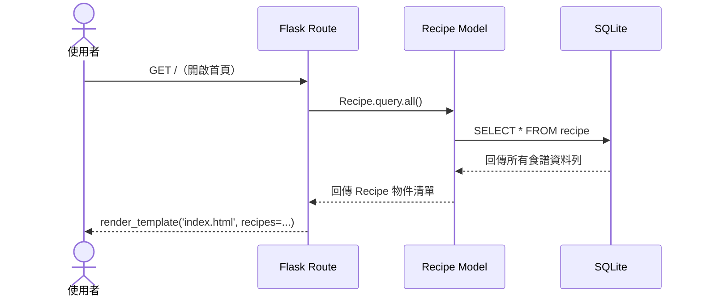
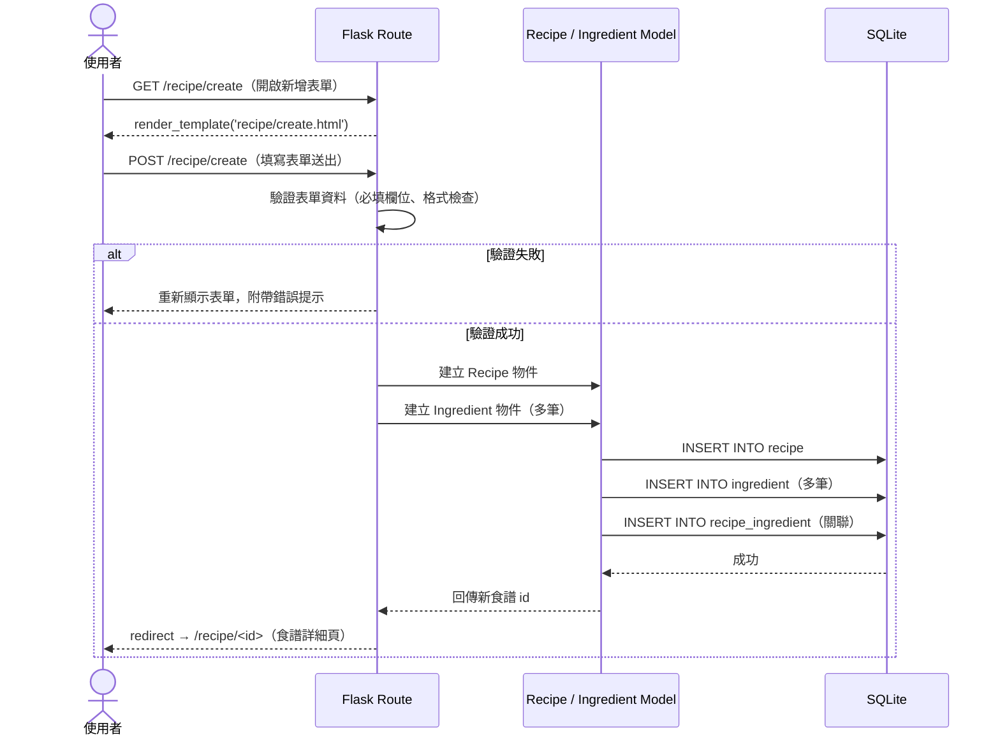
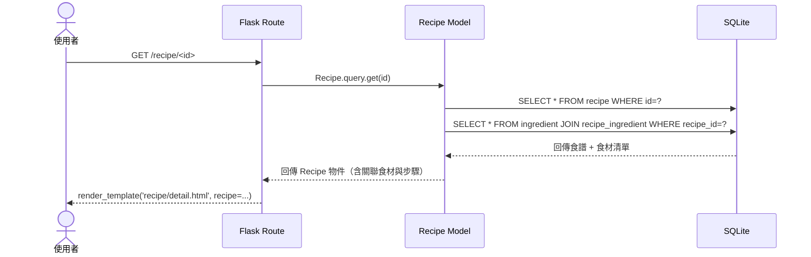
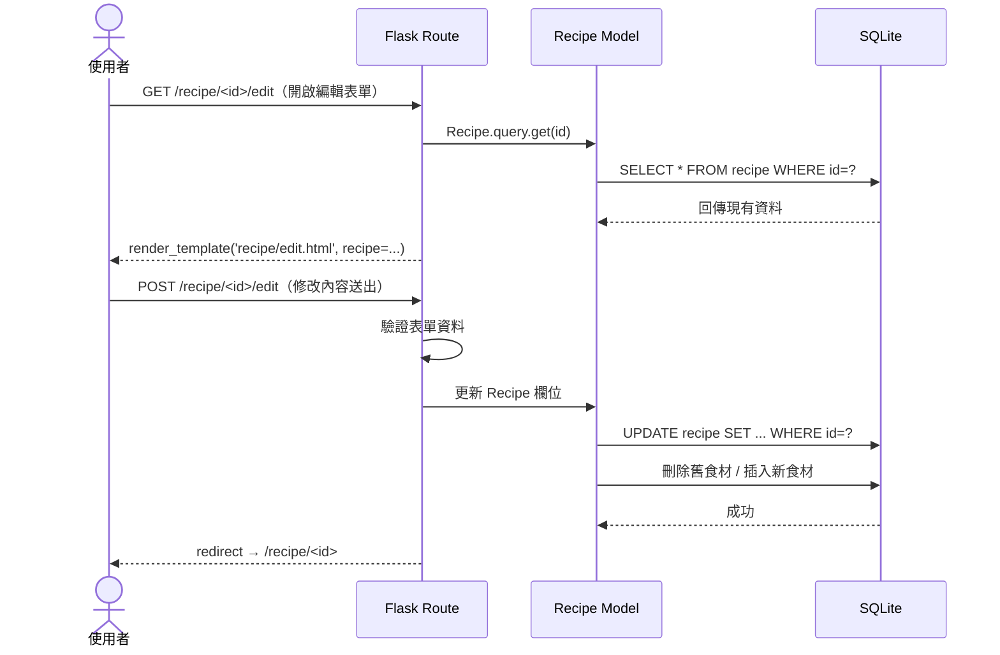
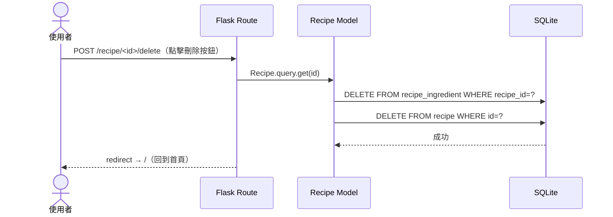
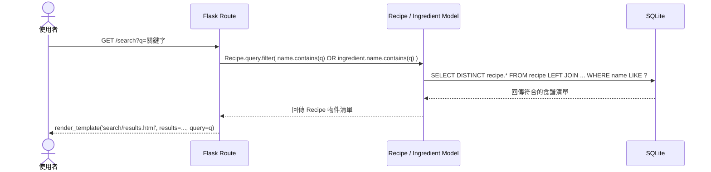
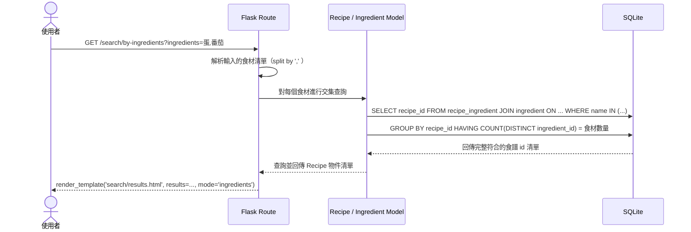

# 食譜收藏夾系統 — 流程圖文件

> 根據 `docs/PRD.md` 與 `docs/ARCHITECTURE.md` 設計，涵蓋使用者操作流程與系統資料流。

---

## 1. 使用者流程圖（User Flow）

描述使用者從進入網站到完成各項操作的完整路徑。

---

## 2. 系統序列圖（System Sequence Diagram）

描述各主要功能在系統內部的完整資料流，角色包含：使用者、Flask Route（Controller）、SQLAlchemy Model、SQLite 資料庫。

---

### 2.1 查看食譜列表（GET /）

---

### 2.2 新增食譜（POST /recipe/create）

---

### 2.3 查看食譜詳細內容（GET /recipe/\<id\>）

---

### 2.4 編輯食譜（POST /recipe/\<id\>/edit）

---

### 2.5 刪除食譜（POST /recipe/\<id\>/delete）

---

### 2.6 搜尋食譜（GET /search）

---

### 2.7 根據食材推薦食譜（GET /search/by-ingredients）

---

## 3. 功能清單對照表

| 功能 | URL 路徑 | HTTP 方法 | 對應模板 | 說明 |
| :--- | :--- | :--- | :--- | :--- |
| 食譜列表（首頁） | `/` | GET | `index.html` | 顯示所有食譜，可依分類篩選 |
| 新增食譜（表單頁） | `/recipe/create` | GET | `recipe/create.html` | 顯示新增食譜的空白表單 |
| 新增食譜（送出） | `/recipe/create` | POST | — | 處理表單，建立食譜後導回詳細頁 |
| 食譜詳細內容 | `/recipe/<id>` | GET | `recipe/detail.html` | 顯示食譜基本資訊、食材、步驟 |
| 編輯食譜（表單頁） | `/recipe/<id>/edit` | GET | `recipe/edit.html` | 顯示預填現有資料的編輯表單 |
| 編輯食譜（送出） | `/recipe/<id>/edit` | POST | — | 更新食譜資料後導回詳細頁 |
| 刪除食譜 | `/recipe/<id>/delete` | POST | — | 刪除食譜與關聯食材後導回首頁 |
| 關鍵字搜尋 | `/search` | GET | `search/results.html` | 依名稱或食材關鍵字搜尋食譜 |
| 食材推薦 | `/search/by-ingredients` | GET | `search/results.html` | 依多項食材交集查詢推薦食譜 |

---

*文件版本：v1.0 | 建立日期：2026-04-21 | 對應架構文件：ARCHITECTURE.md v1.0*
