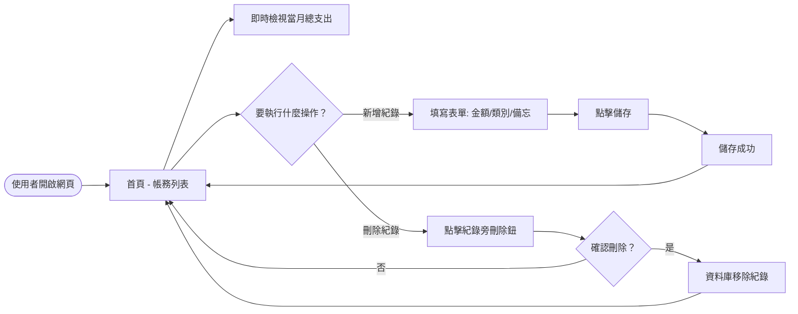
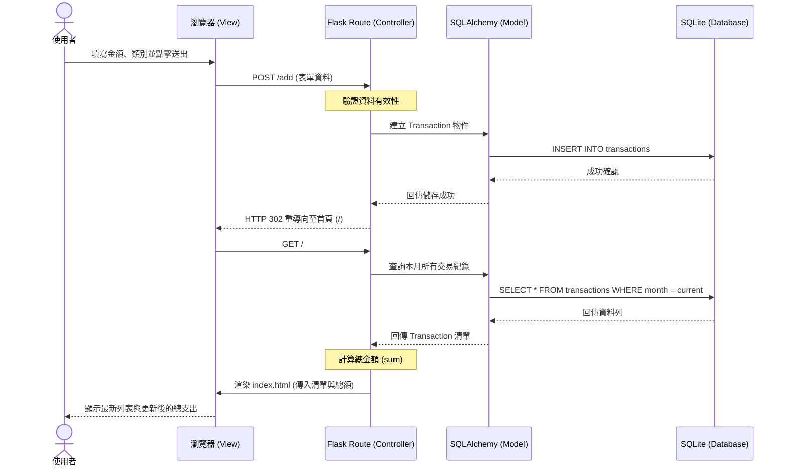

# 快速小資記帳 (QuickSpend) — 流程圖文件

> 本文件描述了系統的使用者操作流程、資料流轉邏輯以及功能路徑對照。

---

## 1. 使用者流程圖 (User Flow)

描述使用者在前端介面上的主要操作路徑。

---

## 2. 系統序列圖 (Sequence Diagram)

以「新增一筆消費紀錄」為例，描述資料從瀏覽器傳遞到資料庫的完整生命週期。

---

## 3. 功能清單對照表

| 功能 | URL 路徑 | HTTP 方法 | 對應控制器邏輯 | 說明 |
| :--- | :--- | :--- | :--- | :--- |
| **首頁顯示** | `/` | `GET` | `index()` | 顯示當月總支出統計與歷史紀錄清單 |
| **新增消費** | `/add` | `POST` | `add_transaction()` | 接收表單資料，存入資料庫後重導向回首頁 |
| **刪除紀錄** | `/delete/<int:id>` | `POST` | `delete_transaction(id)` | 根據 ID 刪除指定紀錄，成功後重導向回首頁 |

---

## 4. 設計補充說明

- **重導向設計**：為了防止使用者重新整理頁面導致重複提交表單，在「新增」與「刪除」操作後皆採用 **Post/Redirect/Get (PRG)** 模式。
- **統計邏輯**：總支出統計由後端即時計算。雖然這會稍微增加資料庫查詢壓力，但對於個人記帳軟體（資料量小）而言，這能確保數據絕對正確且開發維護最簡單。

---
*文件版本：v1.0 | 建立日期：2026-04-23*
